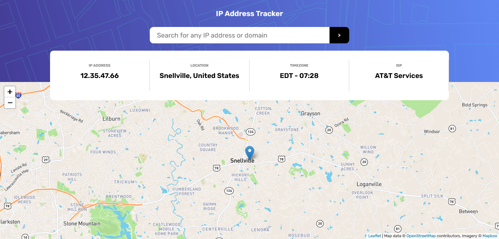

# Frontend Mentor - IP address tracker solution

This is a solution to the [IP address tracker challenge on Frontend Mentor](https://www.frontendmentor.io/challenges/ip-address-tracker-I8-0yYAH0). Frontend Mentor challenges help you improve your coding skills by building realistic projects. 

## Table of contents

- [Overview](#overview)
  - [The challenge](#the-challenge)
  - [Screenshot](#screenshot)
  - [Links](#links)
- [My process](#my-process)
  - [Built with](#built-with)
  - [What I learned](#what-i-learned)
  - [Continued development](#continued-development)
  - [Useful resources](#useful-resources)
- [Author](#author)
- [Acknowledgments](#acknowledgments)

## Overview

### The challenge

Users should be able to:

- View the optimal layout for each page depending on their device's screen size
- See hover states for all interactive elements on the page
- See their own IP address on the map on the initial page load
- Search for any IP addresses or domains and see the key information and location

### Screenshot

### Links

- Solution URL: 
- Live Site URL:

## My process

### Built with

- Semantic HTML5 markup
- CSS custom properties
- Flexbox
- Mobile-first workflow
- map API by LeafletJs
- IP Geolocation API by abstract 

### What I learned

I learned a lot while building this app. I learned how to interact with remote API servers and how to populate the UI with incoming responses from servers. I have used a different API for tracking IP's than what was recommended by Frontend mentors. The API I used allows upto 10000 calls a month as opposed to only 1000 calls on the recommended one. Of course, I'm not sutisfied by this change for the API i used is less accurate when revealing locations.     

### Continued development

I hope to return to this app to make some search engine optimization to the code so users can easily discover it.
 
### Useful resources

- [Resource 1](https://stackoverflow.com) 
- [Resource 2](https://coursera.org) 

## Author

- Frontend Mentor - [@DevAshu](https://www.frontendmentor.io/profile/Ashutosh102)
- GitHub - [DevAshu](https://github.com/Ashutosh102)

## Acknowledgments

As always my deepest gratitudes go to:

Fronend Mentor, 
Coursera,  
W3schools. 

